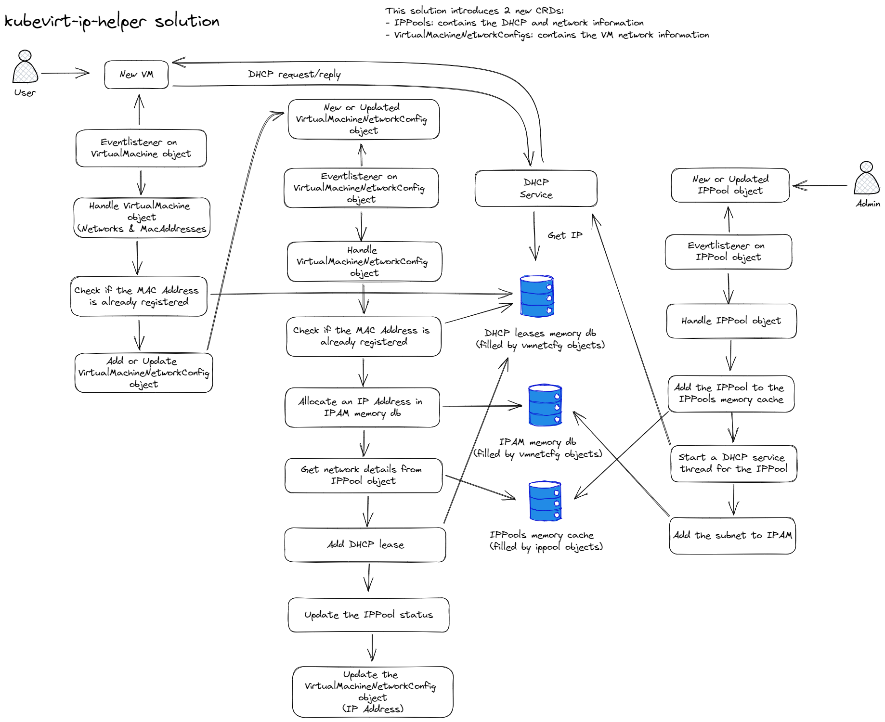

# kubevirt-ip-helper

The kubevirt-ip-helper is a static DHCP solution for KubeVirt Virtual Machines which are attached to a bridged network using Multus. 
It stores it's IP reservations in Kubernetes/ETCD using it's own Custom Resource Definition (CRD) and serve them using it's 
internal DHCP service.

## Use case

This adds a static DHCP service to KubeVirt/Multus bridged networks and is integrated in the Kubernetes event mechanism.
The benefits in comparison to running a classic DHCP service in Kubernetes is that you don't have to use persistent volumes to store 
the lease database or run a seperate service outside your Kubernetes cluster.

Another use case, and this is the main reason why this project was started, is that when you have for example small IP ranges and/or 
limited available IP addresses in a range, you want to avoid that the pool gets exausted with unused IP leases from deleted Virtual 
Machines because they are not expired yet. When using a classic DHCP service you can solve this by putting the lease time very short 
so they will expire faster when they are not claimed anymore. However if a Virtual Machine is down for a certain amount of time and 
this exceeds the lease time the IP can be re-assigned to another Virtual Machine. This could be a problem when you run for example 
Kubernetes with ETCD in those Virtual Machines. ETCD members cannnot find each other anymore and the cluster won't come up.

The kubevirt-ip-helper application will solve this by controlling the following:

* IPs will be automatically assigned to KubeVirt Virtual Machines who are using configured Multus Network Attached Definition networks.
* IPs are always static and assigned to a specific Virtual Machine, also when the lease time is over they won't be released.
* IPs only are released when a Virtual Machine is deleted. This will be done immediately when a deletion is detected.

## How does the kubevirt-ip-helper work?

When KubeVirt Virtual Machines are created the kubevirt-ip-helper controllers picks them up and creates static DHCP reservations 
in the form of VirtualMachineNetworkConfiguration objects and then assign them to an IPPool so they will be picked up by 
the internal DHCP service. The following image gives an overview about the internals of the kubevirt-ip-helper:



## Prerequisites

The following components need to be installed/configured to use the kubevirt-ip-helper:

* Kubernetes
* KubeVirt
* Multus with bridge networking configured
* Auto MAC address registration such as kubemacpool or something simular

## Creating the Kubernetes Custom Resource Definitions (CRDs)

Execute the crd yaml file which is located in the template directory, for example:

```SH
kubectl create -f deployments/crds.yaml
```

## Building the container

There is a Dockerfile in the current directory which can be used to build the container, for example:

```SH
[docker|podman] build -t <DOCKER_REGISTRY_URI>/kubevirt-ip-helper:latest .
```

Then push it to the remote container registry target, for example:

```SH
[docker|podman] push  <DOCKER_REGISTRY_URI>/kubevirt-ip-helper:latest
```

## Deploying the container

Use the deployment.yaml template which is located in the templates directory, for example:

```SH
kubectl create -f deployments/deployment.yaml
```

Before executing the above command, edit the deployment.yaml and:

Configure the Multus NetworkAttachmentDefinition name and namespace:
```YAML
spec:
  [..]
  template:
    metadata:
      annotations:
        k8s.v1.cni.cncf.io/networks: '[{ "interface":"eth1","name":"<NETWORKATTACHMENTDEFINITION_NAME>","namespace":"<NAMESPACE>" }]'
```

> **_NOTE:_** Make sure to replace the \<NETWORKATTACHMENTDEFINITION_NAME> and \<NAMESPACE> placeholders.

Configure the IP address and CIDR mask which the DHCP service should listen on for pod device eth1, for example 172.16.0.2/16:
```YAML
spec:
  [..]
  template:
    [..]
    spec:
      containers:
        [..]
        command:
        - /bin/sh
        - '-ec'
        - |
          ip addr flush dev eth1
          ip addr add <IP_ADDRESS>/<CIDR_MASK> dev eth1
          /app/kubevirt-ip-helper
```

> **_NOTE:_** Make sure to replace the \<IP_ADDRESS> and \<CIDR_MASK> placeholders.

## Usage

### Creating an IPPool object

First you need to create an IPPool object with the Network/DHCP configuration like in the example below. This will allocate a new IPAM subnet memory DB and starts a DHCP service. Make sure the serverip matches the \<IP_ADDRESS> in the deployment.yaml example above otherwise it doesn't responds on DHCP requests.

The following yaml/command can be used to create a new IPPool object with a class b-subnet:

```SH
(
cat <<EOF
apiVersion: kubevirtiphelper.k8s.binbash.org/v1
kind: IPPool
metadata:
  name: <POOL_NAME>
spec:
  ipv4config:
    serverip: 172.16.0.2
    subnet: 172.16.0.0/16
    pool:
      start: 172.16.0.10
      end: 172.16.255.250
      exclude:
        - 172.16.0.67
        - 172.16.100.154
        - 172.16.189.99
    router: 172.16.0.1
    dns:
      - 8.8.8.8
      - 8.8.4.4
    domainname: example.com
    domainsearch:
      - example.com
    ntp:
      - 0.pool.ntp.org
      - 1.pool.ntp.org
    leasetime: 300
  networkname: <NAMESPACE>/<NETWORKATTACHMENTDEFINITION_NAME>
EOF
) | kubectl create -f -
```
> **_NOTE:_** Make sure to replace the \<NAMESPACE>, \<NETWORKATTACHMENTDEFINITION_NAME> and \<POOL_NAME> placeholders.

Now create a Virtual Machine in the same network as the \<NETWORKATTACHMENTDEFINITION_NAME> to test if the DHCP service works.

### Status information

Status information about the IP reservations are kept in the status fields in the ippool objects and in the vmnetcfg objects.

### Logging

By default only the startup, error and warning logs are enabled. More logging can be enabled by changing the LOGLEVEL environment setting in the kubevirt-ip-helper deployment. The supported loglevels are INFO, DEBUG and TRACE.

# License

Copyright (c) 2023 Joey Loman <joey@binbash.org>

Licensed under the Apache License, Version 2.0 (the "License");
you may not use this file except in compliance with the License.
You may obtain a copy of the License at

[http://www.apache.org/licenses/LICENSE-2.0](http://www.apache.org/licenses/LICENSE-2.0)

Unless required by applicable law or agreed to in writing, software
distributed under the License is distributed on an "AS IS" BASIS,
WITHOUT WARRANTIES OR CONDITIONS OF ANY KIND, either express or implied.
See the License for the specific language governing permissions and
limitations under the License.