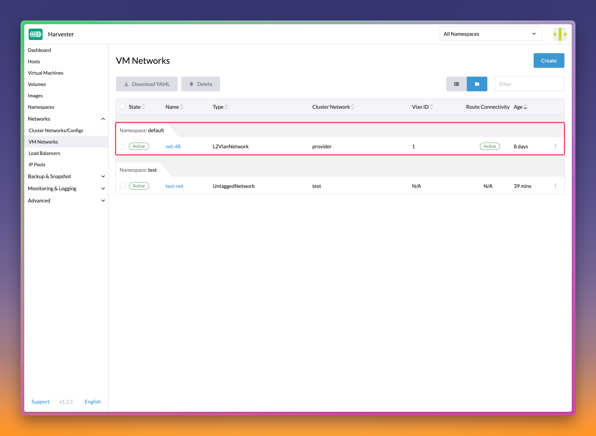
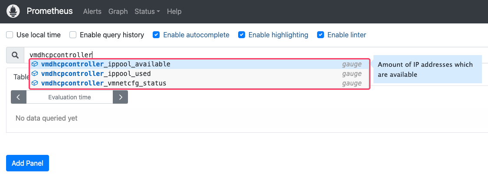

# vm-dhcp-controller

[](https://github.com/harvester/vm-dhcp-controller/actions/workflows/main.yml)
[](https://github.com/harvester/vm-dhcp-controller/releases)

A managed DHCP service for virtual machines running on Harvester, ported from [joeyloman/kubevirt-ip-helper](https://github.com/joeyloman/kubevirt-ip-helper) and its subsidiary projects.

## Features

- DHCP service for virtual machines
  - IP pool declaration (via IPPool custom resources)
  - Per-VM network configuration (via VirtualMachineNetworkConfig custom resources)
  - Static lease support (pre-defined MAC/IP addresses mapping)
- Built-in resiliency in a semi-stateless design
  - States are always kept in etcd
  - Able to reconstruct DHCP leases even when the agent is destroyed and restarted
- Harvester integration
  - Network topology-aware agent (DHCP server) deployment
  - Auto-create IP pool along with **VM Network** creation
  - Auto-create network configuration during VM creation

## Architecture

Introduced CRDs:

- IPPool
- VirtualNetworkNetworkConfig

Components:

- `vm-dhcp-controller` (control plane)
  - Manage the lifecycle of the agent for each IPPool
  - Create/remove VirtualMachineNetworkConfig when VirtualMachine is created/deleted
- `vm-dhcp-agent` (data plane)
  - Maintain DHCP lease store for the IP pool it is responsible for
  - Handle actual DHCP requests

How the controller and agents collaborate to provide DHCP services for virtual machines on Harvester:


## Develop

To generate the crds/controllers/clientsets:

```
go generate
```

## Build

To build the VM DHCP controller/agent and package them into container images:

```
# If you want to have the built images pushed to the designated registry,
# please specify the following two environment variables.
# Also, copy $HOME/.docker under the project directory for `docker push` to work.
export REPO=starbops
export PUSH=true

make
```

If you're on an Apple Silicon Mac with Docker Desktop or OrbStack, and want to build the binary and the image that could be run on a Linux x86_64 box, you'd like to do the following:

```
export ARCH=amd64
make
```

## Run

To run the controller locally attaching to a remote cluster:

```
# Make sure you have the correct config and context set
export KUBECONFIG="$HOME/cluster.yaml"

make run-controller ARGS="--name=test-controller --namespace=default --image=rancher/harvester-vm-dhcp-agent:main-head"
```

Same for the agent (for testing purposes):

```
make run-agent ARGS="--name=test-agent --dry-run"
```

## Install

To install the VM DHCP controller using Helm:

```
helm upgrade --install harvester-vm-dhcp-controller ./chart --namespace=harvester-system --create-namespace
```

The agents will be scaffolded dynamically according to the requests.

## Usage

Create **VM Network** `default/net-48` before proceeding.



Create IPPool object:

```
$ cat <<EOF | kubectl apply -f -
apiVersion: network.harvesterhci.io/v1alpha1
kind: IPPool
metadata:
  name: net-48
  namespace: default
spec:
  ipv4Config:
    serverIP: 192.168.48.77
    cidr: 192.168.48.0/24
    pool:
      start: 192.168.48.81
      end: 192.168.48.90
      exclude:
      - 192.168.48.81
      - 192.168.48.90
    router: 192.168.48.1
    dns:
    - 1.1.1.1
    domainName: aibao.moe
    domainSearch:
    - aibao.moe
    ntp:
    - pool.ntp.org
    leaseTime: 300
  networkName: default/net-48
EOF
```

Create VirtualMachineNetworkConfig object:

```
$ cat <<EOF | kubectl apply -f -
apiVersion: network.harvesterhci.io/v1alpha1
kind: VirtualMachineNetworkConfig
metadata:
  name: test-vm
  namespace: default
spec:
  vmName: test-vm
  networkConfig:
  - macAddress: fa:cf:8e:50:82:fc
    networkName: default/net-48
EOF
```

## Observability

### Metrics

The following metrics are included in the application which can be used for monitoring:

```
Name: vmdhcpcontroller_ippool_used
Description: Amount of IP addresses which are in use in an IPPool
```

```
Dame: vmdhcpcontroller_ippool_available
Description: Amount of IP addresses which are available in an IPPool
```

```
Name: vmdhcpcontroller_vmnetcfg_status
Description: Information and status of the VirtualMachineNetworkConfig objects
```

The chart also contains a ServiceMonitor object which can be automatically picked up by the Prometheus monitoring solution. To get a taste of what they look like, you can query the `/metrics` endpoint of the controller:

```
$ curl -sfL localhost:8080/metrics
# HELP promhttp_metric_handler_errors_total Total number of internal errors encountered by the promhttp metric handler.
# TYPE promhttp_metric_handler_errors_total counter
promhttp_metric_handler_errors_total{cause="encoding"} 0
promhttp_metric_handler_errors_total{cause="gathering"} 0
# HELP vmdhcpcontroller_ippool_available Amount of IP addresses which are available
# TYPE vmdhcpcontroller_ippool_available gauge
vmdhcpcontroller_ippool_available{cidr="172.19.100.0/28",ippool="default/priv-net-cp",network="default/priv-net-cp"} 5
vmdhcpcontroller_ippool_available{cidr="172.19.150.0/28",ippool="default/priv-net-all",network="default/priv-net-all"} 10
vmdhcpcontroller_ippool_available{cidr="172.19.200.0/28",ippool="default/priv-net-wk",network="default/priv-net-wk"} 5
vmdhcpcontroller_ippool_available{cidr="192.168.48.0/24",ippool="default/net-48",network="default/net-48"} 6
# HELP vmdhcpcontroller_ippool_used Amount of IP addresses which are in use
# TYPE vmdhcpcontroller_ippool_used gauge
vmdhcpcontroller_ippool_used{cidr="172.19.100.0/28",ippool="default/priv-net-cp",network="default/priv-net-cp"} 0
vmdhcpcontroller_ippool_used{cidr="172.19.150.0/28",ippool="default/priv-net-all",network="default/priv-net-all"} 0
vmdhcpcontroller_ippool_used{cidr="172.19.200.0/28",ippool="default/priv-net-wk",network="default/priv-net-wk"} 0
vmdhcpcontroller_ippool_used{cidr="192.168.48.0/24",ippool="default/net-48",network="default/net-48"} 2
# HELP vmdhcpcontroller_vmnetcfg_status Status of the vmnetcfg objects
# TYPE vmdhcpcontroller_vmnetcfg_status gauge
vmdhcpcontroller_vmnetcfg_status{ip="192.168.48.86",mac="c6:d6:82:39:d3:c3",network="default/net-48",status="Allocated",vmnetcfg="default/test-vm-01"} 1
vmdhcpcontroller_vmnetcfg_status{ip="192.168.48.87",mac="fa:e7:60:2e:37:dd",network="default/net-48",status="Allocated",vmnetcfg="default/test-vm-02"} 1
```



### Cache Dump

#### Control Plane

Besides checking the status of the custom resources like IPPool and VirtualMachineNetworkConfig objects, you can peek the caches to know the controller's current state.

Check the IPAM cache to see the current IP address allocation of an IPPool with endpoint `/ipams/<network-namespaced-name>`:

```
$ curl -sfL localhost:8080/ipams/default/net-48 | jq .
{
  "192.168.48.82": "false",
  "192.168.48.83": "false",
  "192.168.48.84": "false",
  "192.168.48.85": "false",
  "192.168.48.86": "true",
  "192.168.48.87": "true",
  "192.168.48.88": "false",
  "192.168.48.89": "false"
}
```

Check the MAC cache to see the current MAC-to-IP address mapping of an IPPool with endpoint `/caches/<network-namespaced-name>`:

```
$ curl -sfL localhost:8080/caches/default/net-48 | jq .
{
  "c6:d6:82:39:d3:c3": "192.168.48.86",
  "fa:e7:60:2e:37:dd": "192.168.48.87"
}
```

#### Data Plane

DHCP leases are stored in memory. By querying the `/leases` endpoint of the agent, you can get a clear view on what leases are served by the embedded DHCP server for that particular IPPool.

```
$ curl -sfL localhost:8080/leases | jq .
{
  "c6:d6:82:39:d3:c3": "{\"ServerIP\":\"192.168.48.77\",\"ClientIP\":\"192.168.48.86\",\"SubnetMask\":\"////AA==\",\"Router\":\"192.168.48.1\",\"DNS\":[\"1.1.1.1\"],\"DomainName\":\"aibao.moe\",\"DomainSearch\":[\"aibao.moe\"],\"NTP\":[\"122.117.253.246\",\"17.253.116.253\",\"114.35.131.27\",\"103.147.22.149\"],\"LeaseTime\":300}",
  "fa:e7:60:2e:37:dd": "{\"ServerIP\":\"192.168.48.77\",\"ClientIP\":\"192.168.48.87\",\"SubnetMask\":\"////AA==\",\"Router\":\"192.168.48.1\",\"DNS\":[\"1.1.1.1\"],\"DomainName\":\"aibao.moe\",\"DomainSearch\":[\"aibao.moe\"],\"NTP\":[\"114.35.131.27\",\"122.117.253.246\",\"103.147.22.149\",\"17.253.116.253\"],\"LeaseTime\":300}"
}
```

## License

Copyright 2023-2026 [SUSE, LLC.](https://www.suse.com/)

This project is licensed under the Apache License 2.0 - see the [LICENSE](./LICENSE) file for details.
